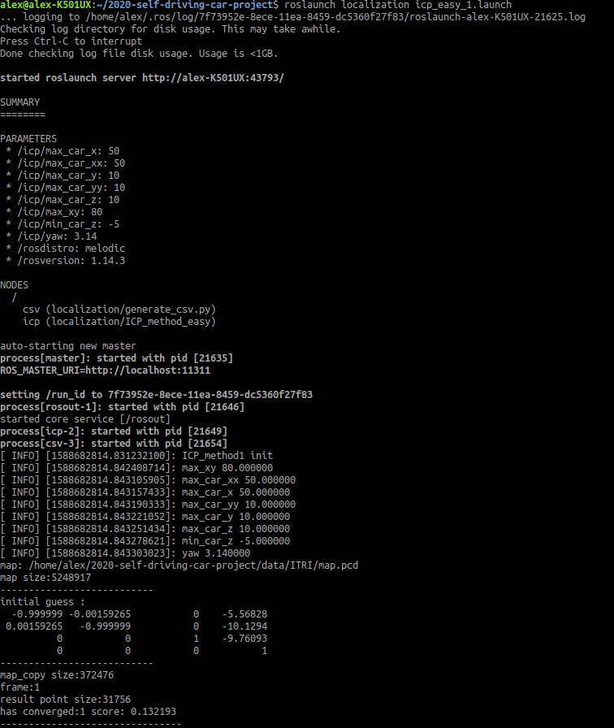
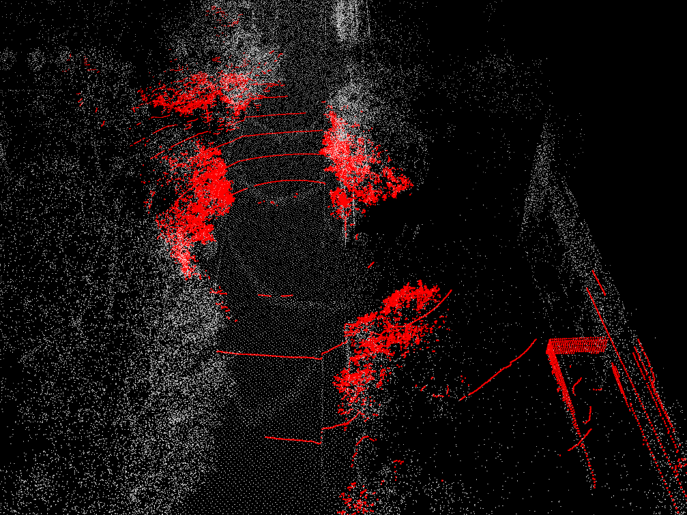
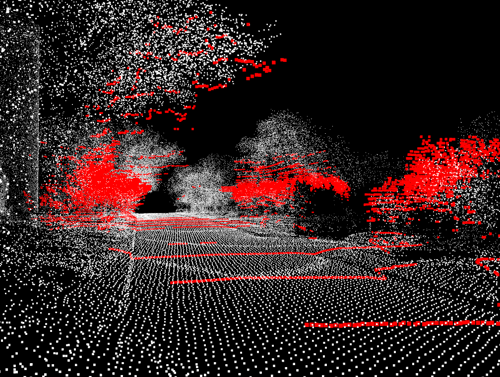

# self-driving-car-project  
  
## How to run  
### Download data  
```bash
$ cd /data
$ python3 download_ITRI.py
```  

### Catkin_make
```bash
$ source catkin_make.sh
```  
### Localization  
#### ITRI_Private_1~3.bag
```bash
$ source environment.sh
$ roslaunch localization icp_easy_[1~3].launch 
  
Open another terminal.
  
$ cd ~/self-driving-car-project/data/ITRI
$ rosbag play ITRI_Private_[___1~3___].bag
```
  
#### Nuscenes_Private_1~3.bag
```bash
$ source environment.sh
$ roslaunch localization icp_medium_[___1~3___].launch 
  
Open another terminal.
  
$ cd ~/self-driving-car-project/data/Nuscenes
$ rosbag play Nu_Private_[1~3].bag
```
  
  
### Visualization
```bash
$ cd rviz
$ rviz -d rviz.rviz
```
  
  

### Evaluate (After finish icp you will get a .csv file in result folder)
#### numpy
```
pip3 install numpy
```

#### Execution
There are some arguments you need to set:
  -g, --ground-truth: The ground truth csv file you want to evaluation
  -r, --result: Your result csv file you want to evaluation
                        
For example:
```
python3 evaluate.py -g itri_200_gt.csv itri_700.csv itri_1400_gt.csv -r path200.csv path700.csv path1400.csv
```

#### Help
```
python3 evaluate.py -h
```

